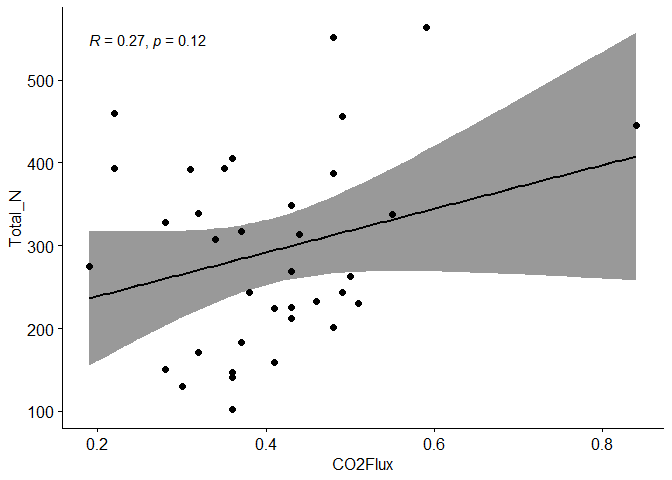
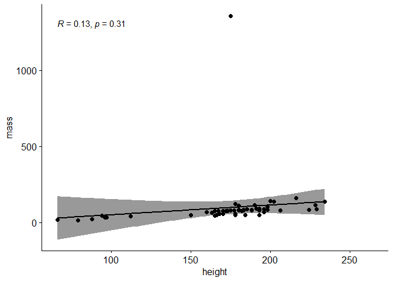

<!-- README.md is generated from README.Rmd. Please edit that file -->

# corgraph

<!-- badges: start -->

<!-- badges: end -->

The goal of corgraph is to add a visual component that complements the
`cor.test()` function.

## Installation

You can install the released version of corgraph from
[github](https://github.com/BuggyBDrizzy/corgraph) with:

``` r
devtools::install_github("https://github.com/BuggyBDrizzy/corgraph")
```

## Example

This is a basic example which shows you how to correlate two vectors:

``` r
library(corgraph)
cortest(datasource = Date, var2 = "Total_N", cormethod = "pearson", verbose = TRUE)
#> [1] "Building scatterplot..."
#> `geom_smooth()` using formula 'y ~ x'
```



    #> [1] "Processing association between paired samples..."
    #> 
    #>  Pearson's product-moment correlation
    #> 
    #> data:  dplyr::pull(datasource, var1) and dplyr::pull(datasource, var2)
    #> t = 1.6138, df = 34, p-value = 0.1158
    #> alternative hypothesis: true correlation is not equal to 0
    #> 95 percent confidence interval:
    #>  -0.06773136  0.54731268
    #> sample estimates:
    #>       cor 
    #> 0.2667399

You can alter the parameters to use an entirely different dataset:

``` r
cortest(datasource = dplyr::starwars, var1 = "height", var2 = "mass", cormethod = "pearson", verbose = TRUE)
#> [1] "Building scatterplot..."
#> `geom_smooth()` using formula 'y ~ x'
#> Warning: Removed 28 rows containing non-finite values (stat_smooth).
#> Warning: Removed 28 rows containing non-finite values (stat_cor).
#> Warning: Removed 28 rows containing missing values (geom_point).
```



    #> [1] "Processing association between paired samples..."
    #> 
    #>  Pearson's product-moment correlation
    #> 
    #> data:  dplyr::pull(datasource, var1) and dplyr::pull(datasource, var2)
    #> t = 1.02, df = 57, p-value = 0.312
    #> alternative hypothesis: true correlation is not equal to 0
    #> 95 percent confidence interval:
    #>  -0.1265364  0.3770395
    #> sample estimates:
    #>       cor 
    #> 0.1338842

#### Development explanation. 1.1

1.  First we used `library(devtools)` to be able to help construct files
2.  `create_package()` initializes the creation
3.  `use_r()` creates the necessary .R files
4.  Ensure `roxygen2` comment skeleton is used to format properly
5.  `uses_mit_license()` adds the necessary license so that people are
    able to download and use the package
6.  document() command is a handy function for documenting your files
    without having to do it manually
7.  `load_all()` roughly simulates what happens when a package is
    installed and loaded with `library`
8.  `use_test()` will create our test file where we use any necessary
    `test_that()` functions
9.  `check()` checks for warnings and errors
10. `use_readme_rmd()` creates an .Rmd to show basic functionality. Rmd
    files allow you to insert code chunks from R
11. `use_vignette()` creates a file that you can use to show
    functionality of your functions and package as a whole
