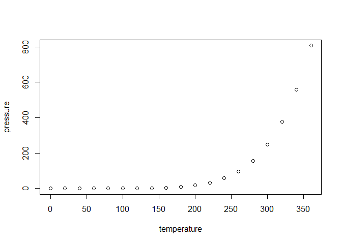

<!-- README.md is generated from README.Rmd. Please edit that file -->

# corgraph

<!-- badges: start -->

<!-- badges: end -->

The goal of corgraph is to add a visual component that complements the
`cor.test()` function.

## Installation

You can install the released version of corgraph from
[CRAN](https://CRAN.R-project.org) with:

``` r
devtools::install_github("https://github.com/BuggyBDrizzy/corgraph")
```

## Example

This is a basic example which shows you how to correlate two vectors:

``` r
library(corgraph)
cortest(datasource = Date, var2 = "Total_N", cormethod = "pearson", verbose = TRUE)
#> [1] "Building scatterplot..."
#> `geom_smooth()` using formula 'y ~ x'
```


    #> [1] "Processing association between paired samples..."
    #> 
    #>  Pearson's product-moment correlation
    #> 
    #> data:  dplyr::pull(datasource, var1) and dplyr::pull(datasource, var2)
    #> t = 1.6138, df = 34, p-value = 0.1158
    #> alternative hypothesis: true correlation is not equal to 0
    #> 95 percent confidence interval:
    #>  -0.06773136  0.54731268
    #> sample estimates:
    #>       cor 
    #> 0.2667399

What is special about using `README.Rmd` instead of just `README.md`?
You can include R chunks like so:

``` r
summary(cars)
#>      speed           dist       
#>  Min.   : 4.0   Min.   :  2.00  
#>  1st Qu.:12.0   1st Qu.: 26.00  
#>  Median :15.0   Median : 36.00  
#>  Mean   :15.4   Mean   : 42.98  
#>  3rd Qu.:19.0   3rd Qu.: 56.00  
#>  Max.   :25.0   Max.   :120.00
```

You’ll still need to render `README.Rmd` regularly, to keep `README.md`
up-to-date.

You can also embed plots, for example:



In that case, don’t forget to commit and push the resulting figure
files, so they display on GitHub\!
